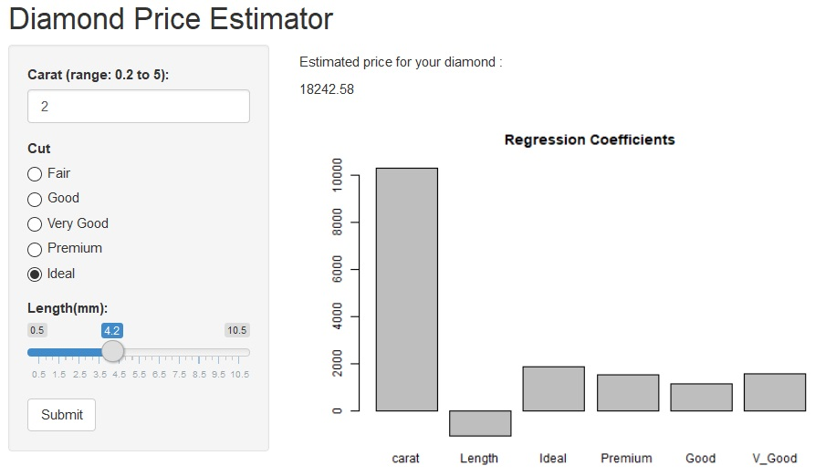

Diamond Estimator
========================================================
author: Peggy Budidharma
date: Sept 03, 2019
autosize: true

Overview
========================================================

Diamond Estimator app provides a price estimation (in US$) for the diamond with characteristics provided by the user.

The following are the characteristics to be provided: 
- Carat
- Cut
- Length (in mm)

Estimator Model
========================================================

Linear regression model using the diamonds dataset available from R.

     lm(price~carat+Length+Ideal+Premium+Good+V_Good+Fair,data=df)
<small>
`Residuals: 
     Min       1Q   Median       3Q      Max  
-22487.6   -637.9    -53.6    360.7  12988.0` 
`            Estimate Std. Error t value Pr(>|t|)    
(Intercept)   204.87     106.69    1.92   0.0548 .  
carat       10325.35      61.12  168.94   <2e-16 ***  
Length      -1064.18      25.82  -41.22   <2e-16 ***  
Ideal        1856.57      38.76   47.90   <2e-16 ***  
Premium      1526.95      39.31   38.84   <2e-16 ***  
Good         1169.40      42.85   27.29   <2e-16 ***  
V_Good       1559.87      39.64   39.35   <2e-16 ***  
Fair              NA         NA      NA       NA    ` 
`---` 
`Signif. codes:  0 '***' 0.001 '**' 0.01 '*' 0.05 '.' 0.1 ' ' 1` 
 
`Residual standard error: 1488 on 53933 degrees of freedom` 
`Multiple R-squared:  0.8609,	Adjusted R-squared:  0.8608`  
`F-statistic: 5.561e+04 on 6 and 53933 DF,  p-value: < 2.2e-16`
</small>

Server Calculation
========================================================

` 
shinyServer(function(input, output){

    data2 <- eventReactive(input$submit, {
      
      car_input <- as.numeric(as.character(input$carat))
      cut_input <- input$cut
      len_input <- input$length
      i_input <- ifelse(cut_input == "i",1,0)
      p_input <- ifelse(cut_input == "p",1,0)
      g_input <- ifelse(cut_input == "g",1,0)
      v_input <- ifelse(cut_input == "vg",1,0)
      f_input <- ifelse(cut_input == "f",1,0)
    
      fit <- lm(price~carat+Length+Ideal+Premium+Good+V_Good+Fair,data=df)
      data4=data.frame(carat=car_input,Fair = f_input, Ideal = i_input, Premium = p_input, Good = g_input, V_Good = v_input,Length=len_input)
     temp_pred <- predict(fit,data4,interval="prediction",level=0.95)
     pred <- temp_pred[1]})
     
    output$text1 <- renderText({data2()})
    output$print1 <- renderPlot({  
      barplot(coefficients(data())[2:7], main="Regression Coefficients")})
})
`

Output
========================================================

